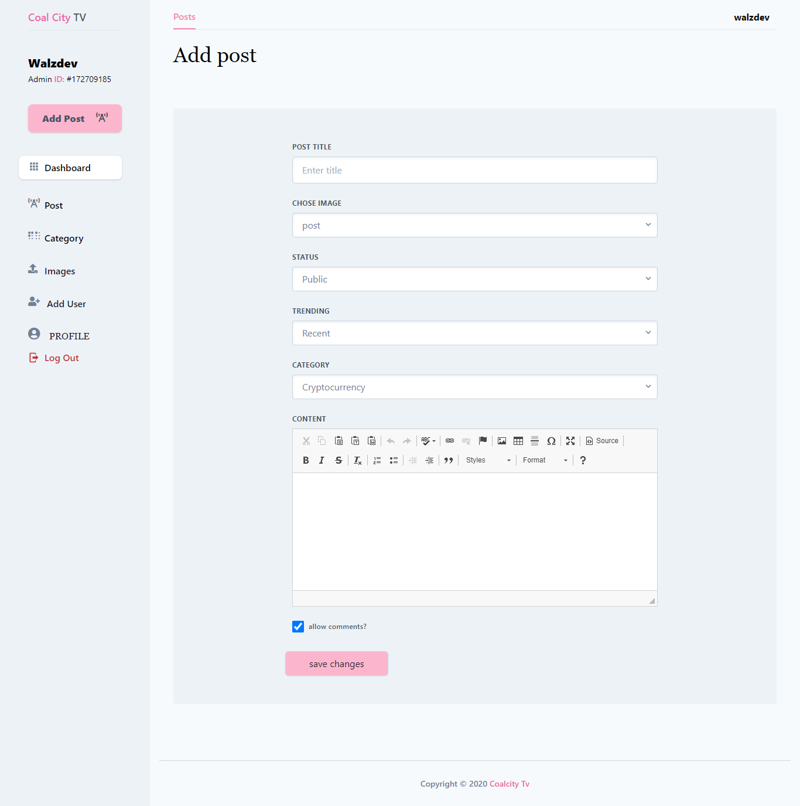
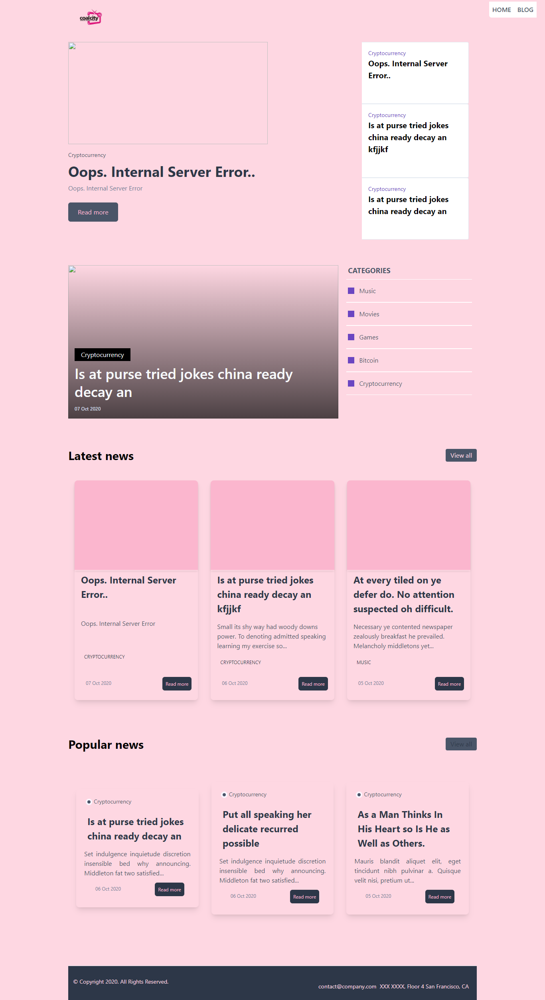

## Coal City Tv Blog .

### application built with Node.JS and Express also Tailwindcss for the UI.

## Live Demo [coalcity-tv](https://coalcitytvapp.herokuapp.com/)

## Admin Login

link to CMS Dashboard https://coalcitytvapp.herokuapp.com/admin </br>

Login Details
- email `test@demo.com`
- password: `demo1234`

#### Also has a CMS for uploading images creating blog post and manageing users account

1. image upload
2. edit user account
3. create posts and category.

#### to run the application clone the repositroy or download, after unpacking the zip file

`npm install`

```
to run the application
 npm start or
npm run dev.
```





